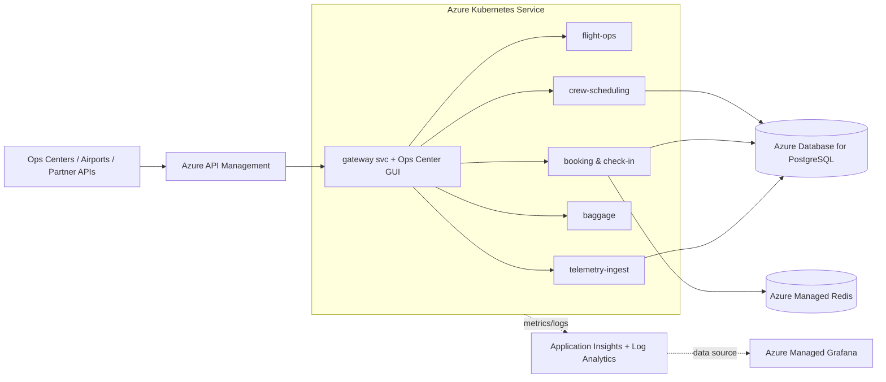

# Aetherion AirOps — Platform

Aetherion AirOps is the **Tier‑0 operational platform** for a global airline
alliance: it coordinates flight operations, crew scheduling, booking &
check‑in, baggage handling and aircraft telemetry, and powers the live
**Ops Center** situational‑awareness dashboard.

This repository is the **application source of truth** for the platform — the
microservice code, Kubernetes manifests, and infrastructure that engineers
deploy and operate.

## Architecture



## Services

| Service | Responsibility |
| --- | --- |
| `gateway` | Public entry via APIM; serves the Ops Center GUI and aggregates downstream health |
| `flight-ops` | Live flight board and flight status |
| `crew-scheduling` | Crew rosters and duty assignment |
| `booking` | Reservations and online check‑in (PostgreSQL + Redis session state) |
| `baggage` | Baggage throughput and in‑transit tracking |
| `telemetry-ingest` | Aircraft telemetry ingestion |

All services run from a single Node.js image; the `ROLE` environment variable
selects which service a pod runs as.

## Repository layout

| Path | Purpose |
| --- | --- |
| `app/` | Node.js application (all microservice roles) + the Ops Center single‑page GUI |
| `k8s/` | Kubernetes manifests (namespace, deployments, services, HPA) |
| `infra/` | Bicep infrastructure (AKS, ACR, APIM, PostgreSQL, Redis, Log Analytics, App Insights, Managed Grafana) |

## Build & run

```bash
# Build the container image (or use `az acr build`)
docker build -t aetherion-airops:latest ./app

# Run a single service locally
docker run -e ROLE=flight-ops -p 8080:8080 aetherion-airops:latest
```

Health endpoints: `/health/live`, `/health/ready`. Aggregated platform health:
`GET /api/status` on the gateway.

## Deploy

Infrastructure is provisioned with the Bicep template under `infra/`, and the
application is applied from `k8s/` to the AKS cluster. See your platform runbooks
for the environment‑specific provisioning steps.
